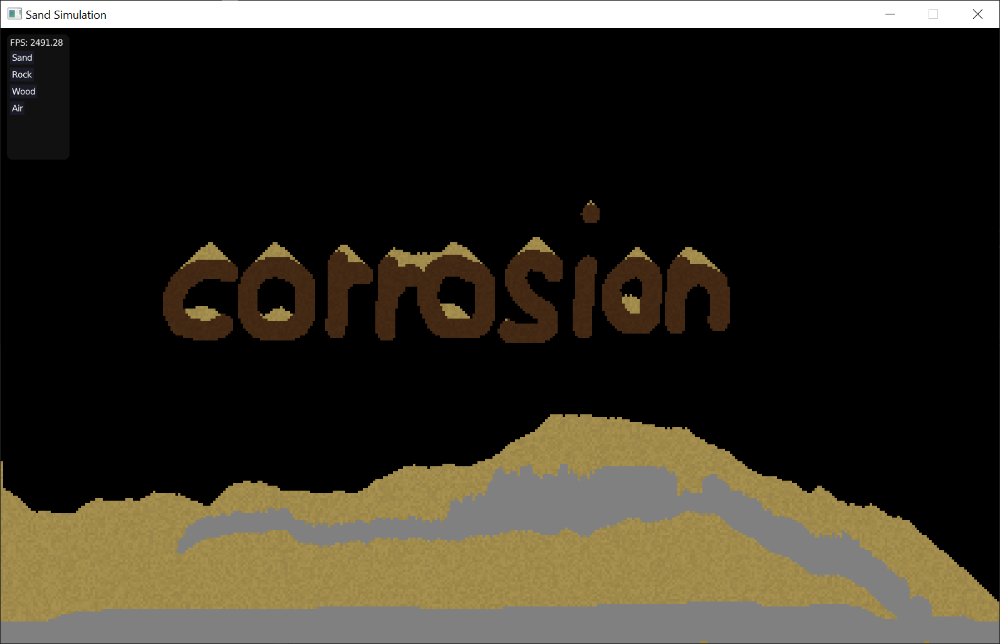
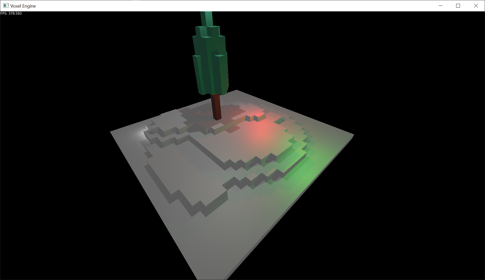
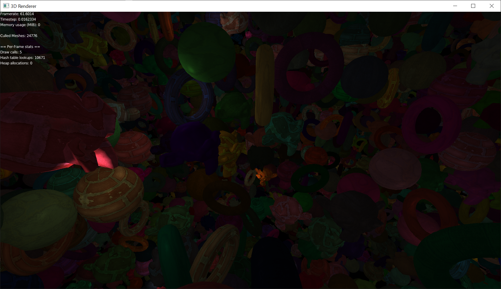
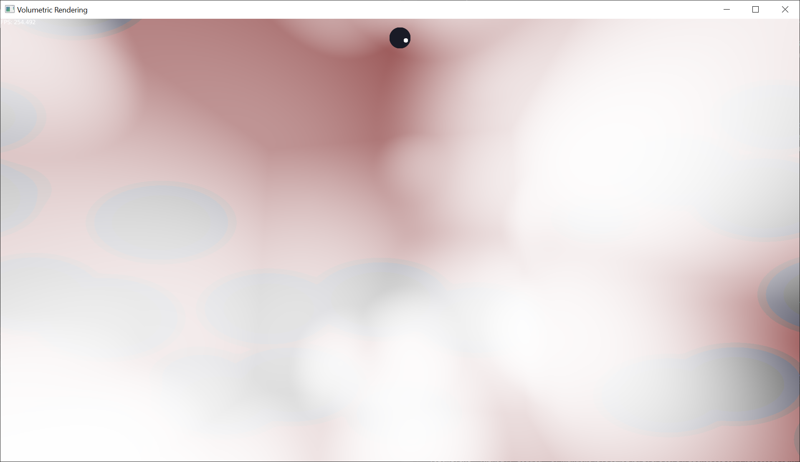

# Corrosion

C graphics framework for GNU/Linux and Windows.

## Notes
 - Vulkan backend that uses the dynamic rendering extension.
 - OpenGL 3.3 backend. Some features (like compute shaders) are not supported on this backend.
 - Support for Emscripten.

The Emscripten backend is still a work-in-progress; Building for Emscripten is not supported
by the included Visual Studio projects yet and some things are unimplemented.

## Build Instructions

### Prerequisites
 - A graphics processor that supports at least Vulkan 1.2 and the VK_KHR_dynamic_rendering extension.
 - Vulkan SDK, including shaderc and SPIRV-Cross.
 - Vulkan validation layers (optional but highly recommended).
 - On GNU/Linux:
	 - X11 (Wayland might be supported in the future as well, but don't count on it).

If you don't have or don't want the first three prerequisites, you can compile with `cr_no_vulkan`
defined to compile with only the OpenGL backend, but most of the demos require Vulkan-only features.

### GNU/Linux
From the `projects/gmake` directory, run:

```
make config=debug run_sbox
```

### Windows
I develop this framework primarily on GNU/Linux, so the Windows platform might be out of date
sometimes.

#### Visual Studio
Open `corrosion.sln` in the `projects/vs2022` directory in Visual Studio 2022, right click
the solution in the Solution Explorer and click "Build Solution".

## Installation
After building, you can optionally install Corrosion to your system to make it easier to use
from projects. On Linux, you can do this by running the "install" target. On Windows, you can
build the "install" Visual Studio project that is part of the solution. On Linux, you must run
as root and on Windows as an administrator. It is recommended to be in release mode when you
build the install target on both platforms.

On Linux, this will create a pkg-config, copy the header files to `/usr/include/corrosion`, copy
the static library to `/usr/lib64` and copy the shader compiler executable to `/usr/bin` with the
name `cshc`.

On Windows, this will copy the header files to `C:\Program Files\corrosion\include`, copy the static
library to `C:\Program Files\corrosion\lib` and copy the shader compiler executable to
`C:\Program Files\corrosion\bin` with the name `cshc.exe`.
It will also set the following environment variables:

| Name                | Target                              |
|---------------------|-------------------------------------|
| CORROSION_SDK       | C:\Program Files\corrosion\         |
| CORROSION_DEPS      | vulkan-1.lib;opengl32.lib;winmm.lib |
| CORROSION_DEP_PATHS | %VULKAN_SDK%\Lib                    |
| PATH                | C:\Program Files\corrosion\bin      |

After installation on Windows, you'll want to restart your shell so that you can use the environment
variables.

## Demos
<figure>
	
	<figcaption>Compute Shader Sand Simulation</figcaption>
</figure>

<figure>
	
	<figcaption>Voxel Raytracer</figcaption>
</figure>

<figure>
	
	<figcaption>Simple 3D Renderer.</figcaption>
</figure>

<figure>
	
	<figcaption>Volumetric Rendering</figcaption>
</figure>

## Note for GitHub users
This repository is hosted on Codeberg and mirrored on GitHub. Issues and pull requests should be
made on the [Codeberg repository](https://codeberg.org/quou/corrosion).
